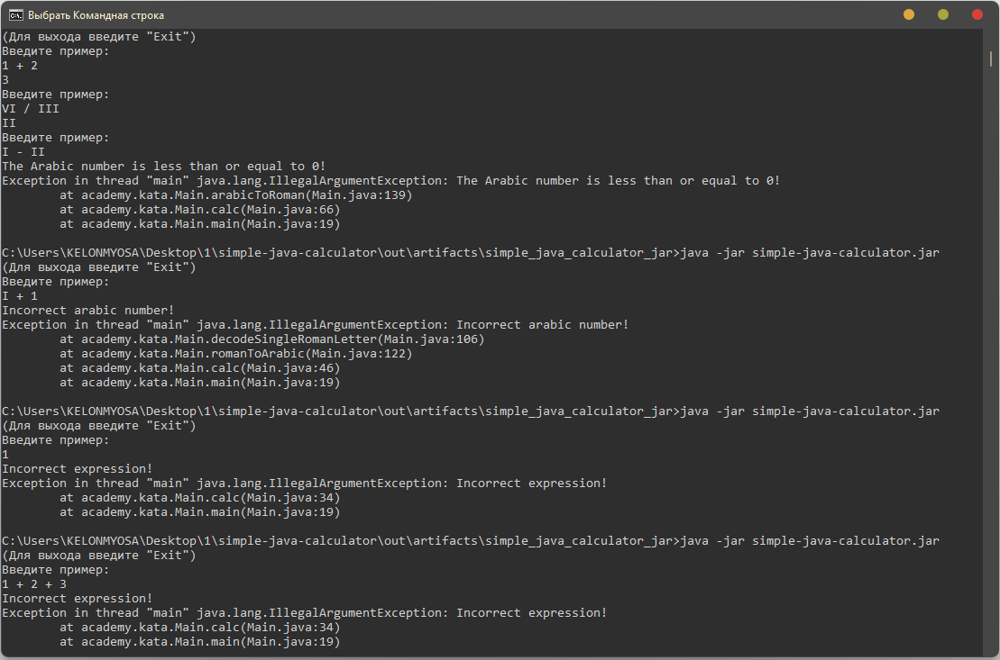

## Простой калькулятор

Консольное приложение “Калькулятор”. Приложение читает из консоли введенные пользователем строки, числа, арифметические операции проводимые между ними и выводит в консоль результат их выполнения.
Реализован класс Main с методом public static String calc(String input). Метод принимает строку с арифметическим выражением между двумя числами и возвращает строку с результатом их выполнения.

### Пример работы программы в командной строке на Windows

  

